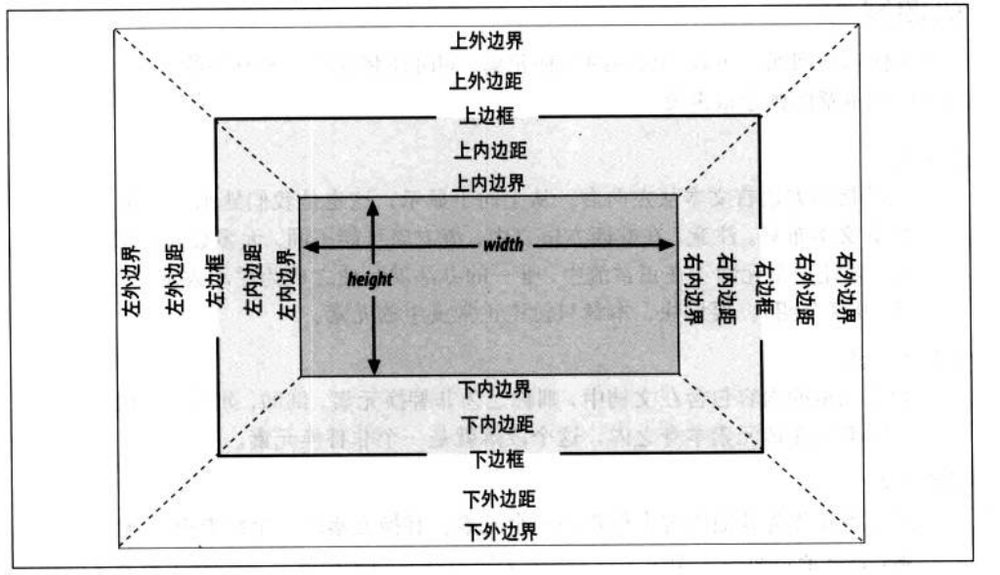

## 基本视觉格式化
###

### 一. 基本框

##### 基本概念

内边距（padding）和边框的宽度（border）不能是负值，但是外边距（margin）可以

1. 正常流

		这是我们熟悉的传统HTML文档的文本布局。
		大多数元素都在正常流中，要让一个元素不在正常流中，唯一的办法就是使之成为浮动或定位元素。

2. 非替换元素

		如果元素的内容包含在文档中，则称之为非替换元素。
		例如，如果一个段落的文本内容都放在该元素本身之内，这个段落就是一个非替换元素。

3. 替换元素

		这是指用作为其他内容占位符的一个元素。
		替换元素的一个经典例子就是`img`元素，它只是指向一个图像文件，
		这个文件将插入到文档流中该`img`元素本身所在位置。
		大多数表单元素也可以替换。

4. 块级元素

		这是指段落、标题或div之类的元素。

5. 行内元素

		这是指strong或span之类的元素。

6. 根元素

		在HTML文档中，这就是元素html。

### 二. 块级元素

下图详细显示了这些一个元素的边界和区域

一般地，一个元素的width被定义为左内边界到右内边界的距离，height则是从上内边界到下内边界的距离

不同的**宽度**、**高度**、**内边距**、**边框**、**外边距**相结合，就可以确定文档的布局。

##### 水平格式化

考虑以下：

	
wideness

可知整个元素框的宽度为200+10*2+20*2=260像素

一定要知道这样会**隐式**地增加width值

**注意**：

大多数人认为,`width`是指可见元素框的宽度，即如果为一个元素声明了内边距、边框以及宽度，

他们指定的宽度值就是左外边界到右外边界的距离，但在CSS中并不是这样，一定要牢记。

**对此有一个很简单的规则：**

正常流中块级元素框的水平部分总和就等于父元素的宽度width。

假设一个div中有两个段落，这两个段落的外边距设置为1em。

段落的内容宽度（width的值）再加上其左右内边距，边框或外边距，加在一起正好是div内容区的width。

**水平属性**

水平格式化七大属性：

* margin-left
* border-left
* padding-left
* width
* padding-right
* border-right
* margin-right

这七个属性的值加在一起必须是元素包含块的宽度，这往往也是块元素的父元素的宽度值（因为块级元素的父元素几乎都是块级元素）

这七个属性中，只有三个属性可以设置为`auto`：width，以及左右外边距。其余属性必须设置为特定的值，或者默认宽度为0。

**使用auto**

如果设置`width`、`margin-left`、`margin-right`中的某个值为auto,而余下两个指定为特定的值，那么设置为`auto`的属性会确定所需的长度，从而使元素框的宽度等于父元素的width。

**不止一个auto**

	// 使元素在其父元素中居中
	// 不同于使用text-align（text-align只应用于块级元素的内联内容，而不是该块级元素）
	p {width: 100px;margin-left: auto;margin-right: auto;}

**全为auto**

这时两个外边距都会设置为0，而width会尽可能宽。这种结果与默认情况是相同的，即没有为外边距或width显示声明任何值

##### 替换元素

前面介绍了正常文本流中非替换块级元素的水平格式化。

非替换块元素的所有规则同样适用于替换块元素，只有一个例外：

如果width为auto，元素的宽度则是内容的固有宽度。

##### 垂直格式化

垂直格式化七大属性：

* margin-top
* border-top
* padding-top
* height
* padding-bottom
* border-bottom
* margin-bottom

这七个属性必须等于元素包含块的height，这往往是块级元素父元素的height值

同样，这七个属性中，只有三个属性可以设置为`auto`：height，以及上下外边距。其余属性必须设置为特定的值，或者默认为0。

有意思的是，如果正常流中一个块元素的`margin-top`或`margin-bottom`设置为auto，它会自动计算为0，与不显示声明是不一样的。

### 三. 行内元素

> 非替换元素和替换元素在内联内容方面的处理稍有不同，讨论行内元素的构造时我们将分别进行讨论。

##### 行内非替换元素

行内元素的边框边界由`font-size`而不是`line-height`控制。

换句话说，如果一个`span`元素的`font-size`为12px，`line-height`为36px，其内容区就是12px高，36px只是相对于其父块级元素增加了内边距padding的值。

可以为行内元素**指定内边距**，这会把边框从文本本身拉开：

	span {border: 1px solid black; padding: 4px;}

至于外边距，实际上，外边距不会应用到行内非替换元素的顶端和底端（即`margin-top`和`margin-bottom`无效），不过，两端则是有效的（即`margin-left`和`margin-right`有效）。

##### 行内替换元素

行内替换元素可以设置**宽度**、**高度**、**外边距**（包括`margin-top`和`margin-bottom`）、内边距。

### 四. 改变元素显示

属性：`display`

常用值：

* none
* inline
* block 
* inline-block

这里介绍下行内块元素inline-block

行内块元素作为一个行内框与其他元素和内容相关。

换句话说，它就像图像一样放在一个文本行中，实际上，行内块元素回座位替换元素放在行中。

它可以像所有块级或行内替换元素一样，设置宽度、高度和外边距，但却是以行内元素呈现。
