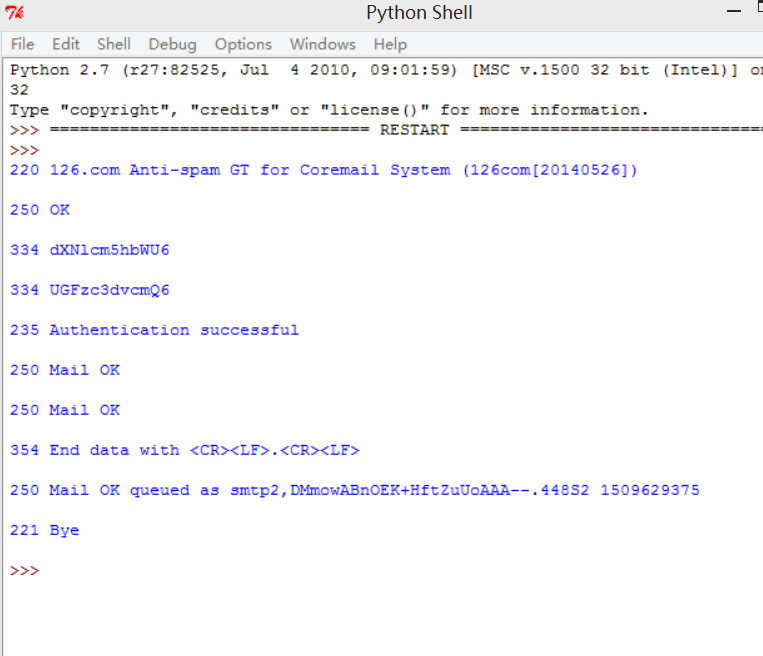
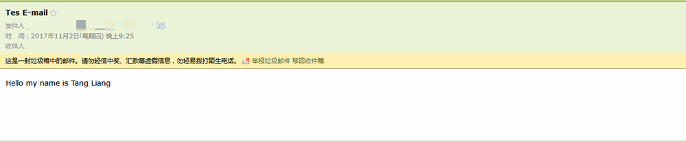

## Lab3——SMTP

#### 实现

1. 与163邮件服务器建立TCP连接，域名"smtp.126.com",SMTP默认端口号25。使用163邮件服务器的原因是其默认开放SMTP服务，而qq邮箱则需要手动开启（而且必须要在有密保情况下才让开，很坑。。。）
2. 发送"HELO"命令，开始与服务器的交互
3. 发送"AUTH LOGIN"命令，开始验证身份,成功后需要发送用户名和密码
4. 发送经过base64编码的用户名（发送者的邮箱）
5. 发送经过base64编码的密码（邮箱授权码，不是邮箱密码）
6. 发送"MAIL FROM"命令，并包含发件人邮箱地址
7. 发送"RCPT TO"命令，并包含收件人邮箱地址
8. 发送"DATA"命令，表示即将发送邮件内容
9. 发送邮件内容，以“./r/n”表示结束输入
10. 发送"QUIT"命令，断开与邮件服务器的连接

#### 运行结果

登录收件人邮箱可看到邮件（可能在垃圾箱）

参考：

1. [《计算机网络－自顶向下方法(原书第6版)》笔记](https://github.com/moranzcw/Computer-Networking-A-Top-Down-Approach-NOTES)
2. [Python Socket编程：利用SMTP发送MIME协议邮件](http://www.jianshu.com/p/de6b15ff1baf)