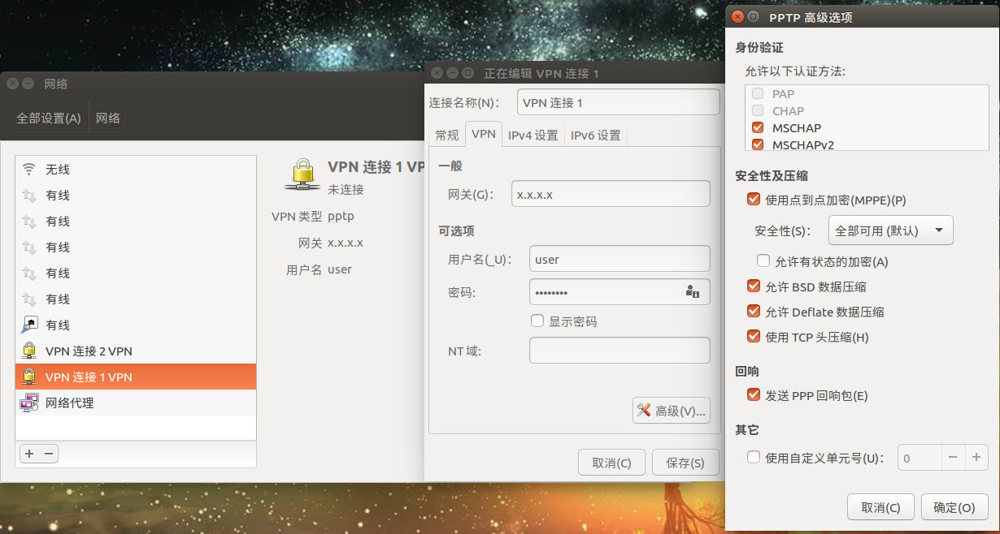

## ubuntu下搭建pptp(Point to Point Tunneling Protocol) vpn
###

> 本文介绍如何在ubuntu环境下搭建pptp vpn来越过GFW

> 其实一直是用ss的...但最近做毕设涉及到搭建k8s集群(需要在虚拟机内的终端拉取国外镜像), 因此尝试搭建下vpn顺便补补相关知识(大雾)

### 具体搭建方法
1. 购买一台国外vps(用了之前搭建ss server的那台)

2. 安装pptpd以提供vpn服务

       sudo apt-get install pptpd

3. 修改pptpd.conf中的相关配置信息

       sudo vim /etc/pptpd.conf
       
       在打开的内容里面找到下面这两行, 并取消掉注释
       localip  192.168.0.1
       remoteip 192.168.0.234-238,192.168.0.245

       分别为创建vpn时的主机ip和连接vpn的其他主机使用的ip段, 可以自行修改

       注意, 这里的ip并不是指外网ip或者当前局域网ip, 而是指创建VPN（虚拟专用网络）会分配的ip地址. 一般这个可以不用修改, 我没有更改）
       
4. 修改chap-secrets以分配vpn账号

       sudo vim /etc/ppp/chap-secrets
       
       打开之后, 我们在文档末尾添加新的账号, 格式如下：
       用户名 pptpd 密码 *
       
       比如: zhangsan  pptpd  123456  *
       
       末尾的*表示可以使用任意IP连入, 如果你要设置指定IP才能连接到vpn, 可以将*替换成对应的IP
       
       如果要添加多个账号, 只需要换行, 然后按照格式继续输入即可
       
5. 设置vpn的ms-dns

       sudo vim /etc/ppp/pptpd-options
       
       一般来说, 内网借助vpn访问外网, 只需要在这里填上外网的dns就可以了, 比如谷歌的dns8.8.8.8和8.8.4.4这样配置ms-dns就可以了, 可以直接到下一步了
       ms-dns 8.8.8.8
       ms-dns 8.8.4.4
       
6. 开启内核IP转发

       sudo vim /etc/sysctl.conf
       
       在打开的文档中找到#net.ipv4.ip_forward=1并取消掉注释
       
       保存之后, 在终端中输入命令使我们的修改生效:
       sudo sysctl -p
       
7. 配置iptables

       首先, 如果没有安装iptables, 要先进行安装, 安装过的可以跳过：
       sudo apt-get install iptables
       
       接下来, 清除iptables里旧的规则（这里针对之前装过pptp, 但是没配置好的同学.如果是从我这个教程开始的, 并且新装的iptables, 这一步可以跳过）
       sudo iptables -F
       sudo iptables -X
       sudo iptables -t nat -F
       sudo iptables -t nat -X
       
       然后, 允许gre协议以及1723端口, 47端口
       sudo iptables -A INPUT -p gre -j ACCEPT
       sudo iptables -A INPUT -p tcp --dport 1723 -j ACCEPT
       sudo iptables -A INPUT -p tcp --dport 47 -j ACCEPT
       
       下一步，开启NAT转发：
       sudo iptables -t nat -A POSTROUTING -s 192.168.0.0/24 -o ens3 -j MASQUERADE
       注意, 上面的ens3是我连接网络的网卡的名称, 不同机器这个可能是不一样的. 如果不清楚是哪一块网卡联网以及网卡的名称, 可以在终端输入ip a来查看
       
8. 重启服务, 使我们的配置生效

       sudo service pptpd restart
       
这个时候, 其他机器使用我们之前配置的账号密码, 已经可以连接上VPN, 并通过VPN来访问外网了!

客户端具体配置如下图:

### 结语

至此, pptp vpn的搭建已经完成...

相比ss, vpn的好处就是对外流量都经过tunnel直接到国外vps上去了, 相当于直接在国外访问外网

但是在我使用的过程中, 一般使用一天后再尝试连接vpn就连不上了= =, 具体什么原因还没找到... 反正删掉vps重新建一台再走一遍搭建流程就能work...所以后来基本在搭建完k8s集群后就弃用了)

ref:

1. [https://blog.csdn.net/aaronjny/article/details/74357535](https://blog.csdn.net/aaronjny/article/details/74357535)
